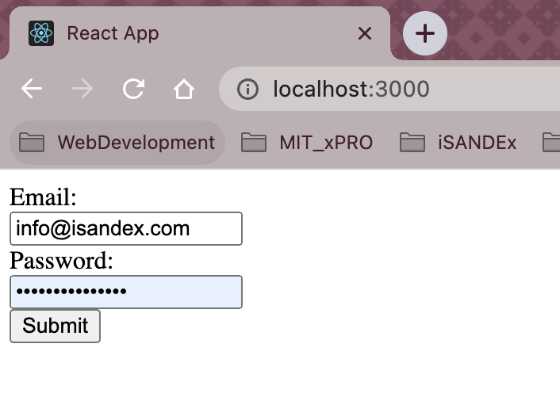

<h1 align="center">
  Learning <a href="https://reactjs.org/" target="_blank"> React.js </a>
</h1>
<h4 align="center">Create a form with <a href="https://formik.org/docs/tutorial" target="_blank"> Formik </a> </h4>

  
  
  
  

  <a href="#description">Description</a> •
  <a href="#file-manifest">Files</a> •
  <a href="#how-to-run">How To Run</a> •
  <a href="#roadmap-of-future-improvements">What's next?</a> •
  <a href="#contributing">Contributing</a> •
  <a href="#credits">Credits</a> •
  <a href="#license-information">License</a>

  

#  Description 
Formik Form is an exercise to learn [React.js](https://reactjs.org/) by creating forms with [Formik](https://formik.org/). This is a practice work I am doing as part of the [full-stack web developer certificate](https://executive-ed.xpro.mit.edu/professional-certificate-coding) I am pursuing. 

The idea of this exercise is to build a form using the [React.js](https://reactjs.org/) library [Formik](https://formik.org/), so we can build up confidence on working with react components while leaving the hard work of wiring them to a widely used open-source form library.

Unfortunately, to see this application in action, you need to clone it and set it up on a local server, such as a lightway static [`npm` server](https://www.npmjs.com/package/serve). In the next section, I provide a few guidelines to serve this particular application using `npm`.

This particular example, is a very simple example of a form, that doesn't take you anywhere, but shows you how to check the user input correct values for each field. Despite the basic type, this app can be the basis for a much more sophisticated user-access controlled application. 

#   How to Run

# Roadmap of future improvements

# Contributing
Pull requests are welcome, and I'll be happy to chat about any improvement or extension that could be donde to this app.

# Credits
This software uses the following third party tools, libraries and logos:
* [React.js](https://reactjs.org/)
* [Formik](https://formik.org/)
* [npm serve](https://www.npmjs.com/package/serve)
* [React.js](https://www.pngwing.com/en/free-png-cgbgg/download) and [Formik](https://iconduck.com/icons/94322/formik) logos 

# License information
This project is licensed under the terms of <a href="https://github.com/jlulloaa/formik_form/blob/main/LICENSE" target="_blank"> MIT license </a>
